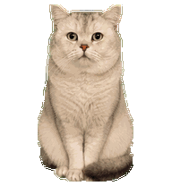
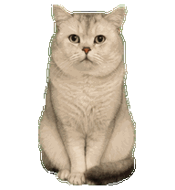
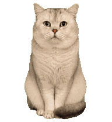
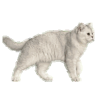
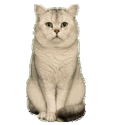
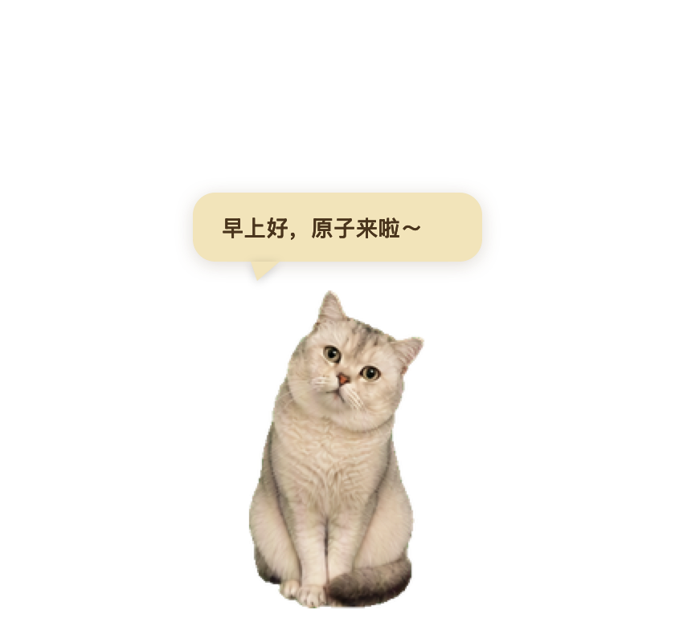
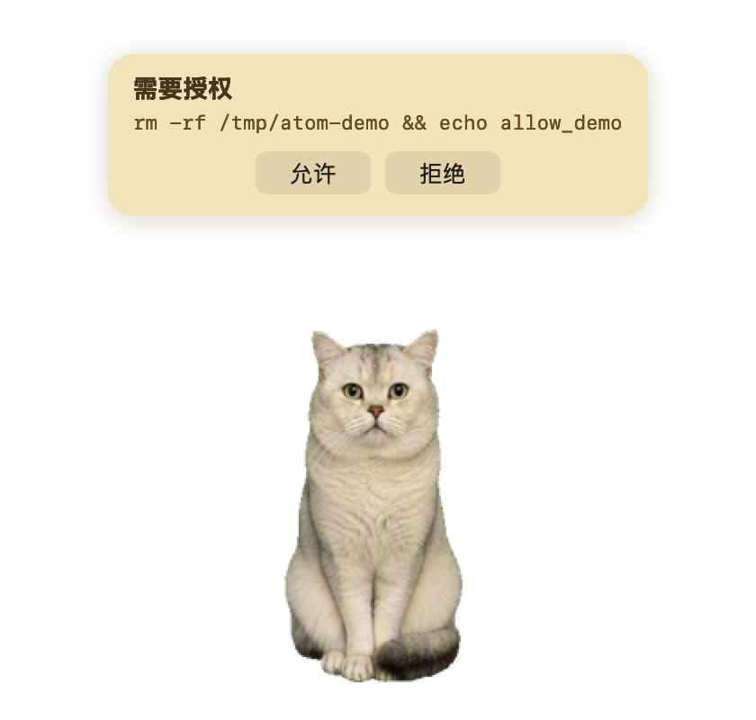

# Pet Maker

把真实宠物照片/视频做成桌面宠物，并配上 Cat Bubble 侧车的开源 Skill 合集。

## 仓库内容

- [pet-maker](pet-maker/README.md)：从素材到宠物图集再到侧车的完整生成流程，含省 Token 指南、拍照要求、拿来即用提示词
- [cat-bubble-skill](cat-bubble-skill/README.md)：Cat Bubble 桌面侧车，透明置顶小猫、语录气泡、鼠标交互、可选 Codex 授权气泡
- [cat-bubble](cat-bubble/README.md)：可直接运行的 Cat Bubble 应用，含 Swift 源码、宠物素材、语录和编译好的程序

## 一键复用

想在另一台 Mac 用 Codex 完整复刻原子？直接复制 [PROMPT.md](PROMPT.md) 给 Codex，让它先复述一遍再动手。

## 风格

照片抠图风格，不做动漫/卡通化。喜欢真实宠物质感的人适合使用。

## 预览

| 待机 | 挥手 | 跳跃 |
| --- | --- | --- |
|  |  |  |

| 奔跑 | 看向指针 | 语录气泡 |
| --- | --- | --- |
|  |  |  |

## 运行要求

- 生成流程：需要一个能读写文件并执行脚本的 Agent，以及 macOS + Python/Pillow 环境
- 运行 Cat Bubble：Apple Silicon Mac，macOS 15+，不需要 Codex、不需要 AI 服务

## License

MIT
